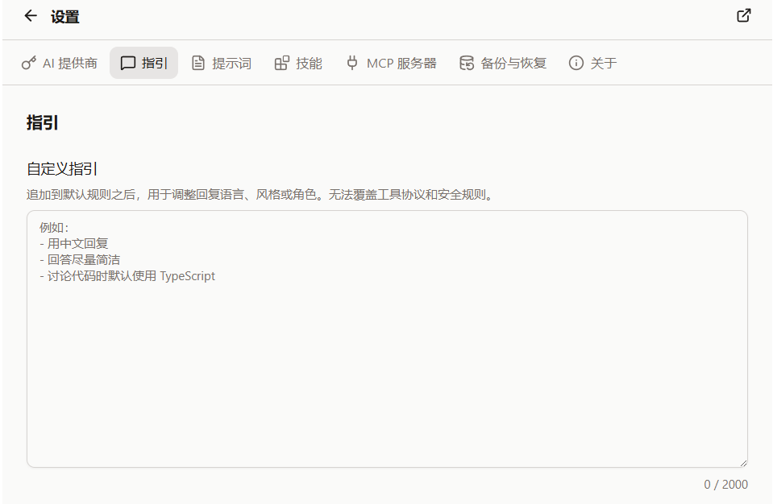

import QA from '@/components/docs/QA.astro';
import QAItem from '@/components/docs/QAItem.astro';

自定义指引用来告诉 Cebian：以后和你对话时，默认应该怎么回答。

它更适合放长期偏好，比如回复语言、语气、代码风格、解释深度等。临时任务还是直接写在输入框里更合适。




## 设置方式

入口在「设置 → 指引」。

在「自定义指引」里写下你的偏好即可，内容会自动保存。下一次发消息时，Cebian 会把这些指引追加到默认规则后面。

比如可以写：

```md
- 默认用中文回复
- 回答尽量简洁
- 讨论代码时默认使用 TypeScript
- 给方案时先说推荐做法，再说可选方案
```

## 适用内容

建议写稳定、长期有效的偏好：

- 回复语言：默认用中文，必要术语保留英文
- 输出风格：少一点寒暄，直接给结论
- 技术偏好：代码示例优先 TypeScript，命令优先 pnpm
- 协作习惯：不确定时先问，不要直接猜

如果只是某一次对话里的要求，直接写在那条消息里就好，不必放进自定义指引。

## 边界说明

自定义指引会追加到 Cebian 默认规则之后，但不能覆盖工具协议和安全规则。

比如：

- 不能让模型绕过工具权限
- 不能让模型读取浏览器不允许读取的页面
- 不能让模型访问你电脑上的真实文件系统
- 不能让模型忽略网页内容可能带来的恶意指令风险

简单说，它适合调整「怎么回答」，不适合改掉 Cebian 的安全边界。

## 常见写法

可以从一小段开始，不用写得很完整：

```md
默认用中文回复。回答先给结论，再给必要步骤。
如果需要我选择方案，请说清楚推荐哪一个，以及为什么。
```

后面觉得哪里不顺，再回来慢慢改。

## Q&A

<QA>
	<QAItem q="感觉模型话太多怎么办？">可以在这里写「回答尽量简洁」。</QAItem>
	<QAItem q="想固定输出格式怎么办？">写清楚标题、列表、表格等格式偏好即可。</QAItem>
	<QAItem q="某次对话不想遵循这些指引怎么办？">直接在那次消息里说明即可。</QAItem>
	<QAItem q="写得太复杂反而效果不好怎么办？">删掉不常用的规则，保留最重要的几条。</QAItem>
</QA>
